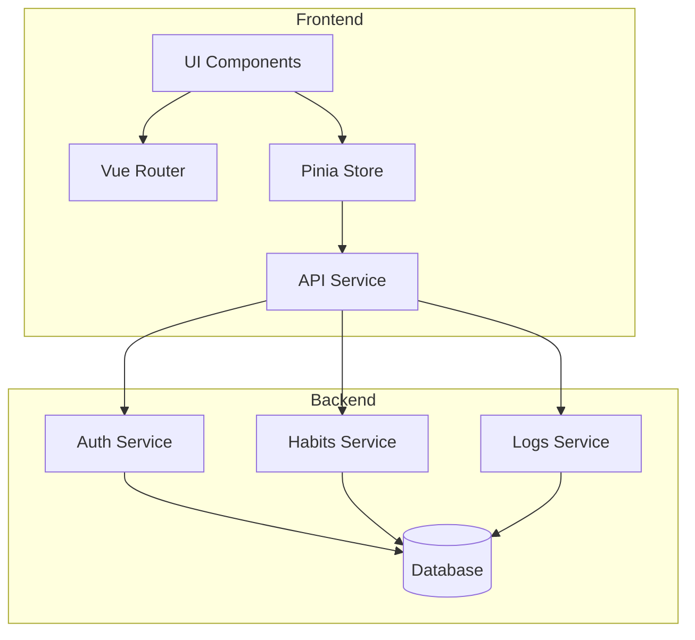
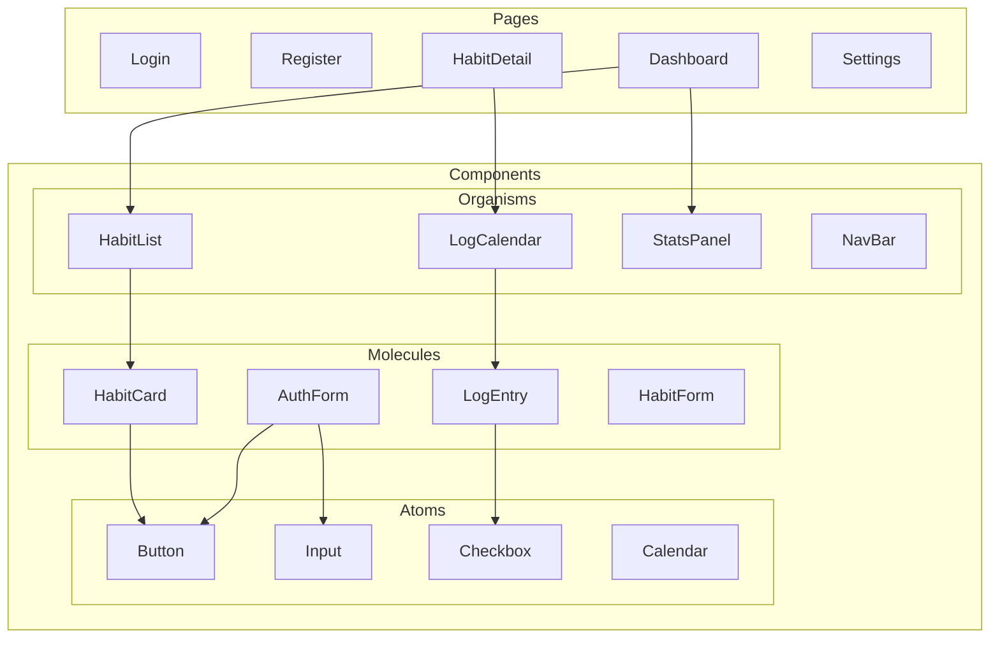
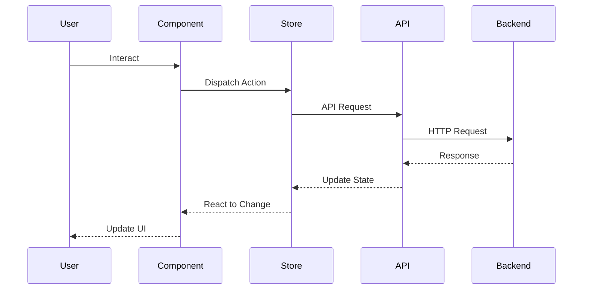
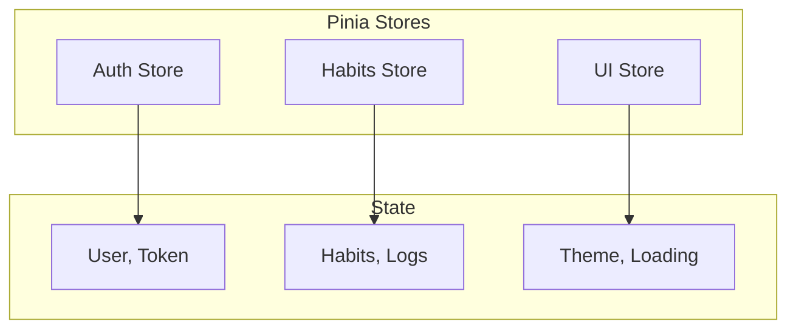
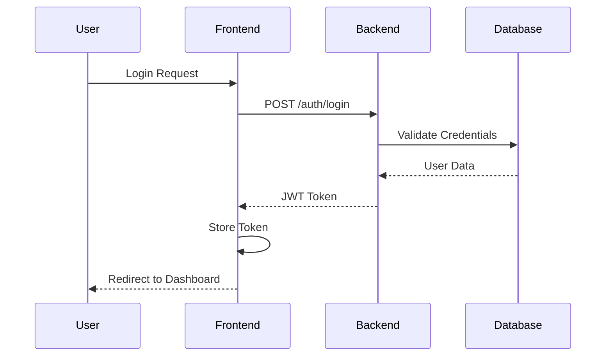
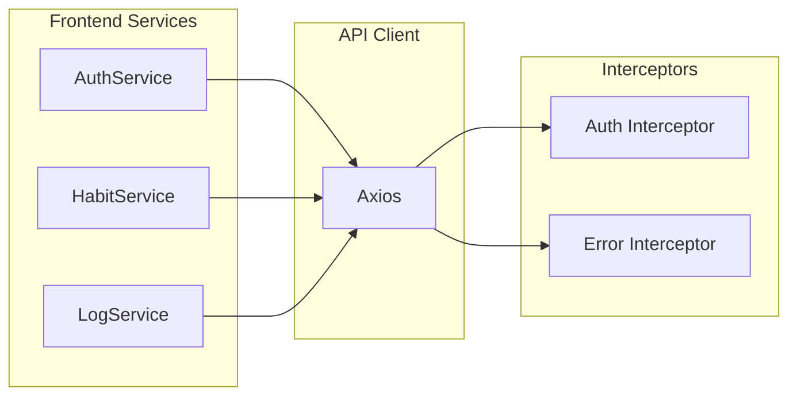
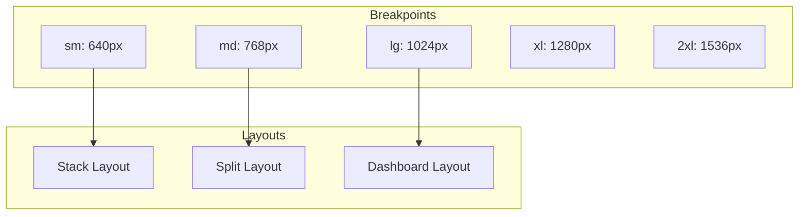

# Architecture Documentation

## High-Level Architecture



## Component Architecture



## Data Flow



## Directory Structure
```
frontend/
├── src/
│   ├── assets/
│   │   ├── styles/
│   │   └── images/
│   ├── components/
│   │   ├── atoms/
│   │   ├── molecules/
│   │   └── organisms/
│   ├── composables/
│   ├── layouts/
│   ├── pages/
│   ├── router/
│   ├── services/
│   │   ├── api/
│   │   └── auth/
│   ├── stores/
│   ├── types/
│   └── utils/
├── public/
├── tests/
│   ├── unit/
│   └── e2e/
└── dist/
```

## State Management



## Authentication Flow



## API Integration



## Responsive Design Strategy


